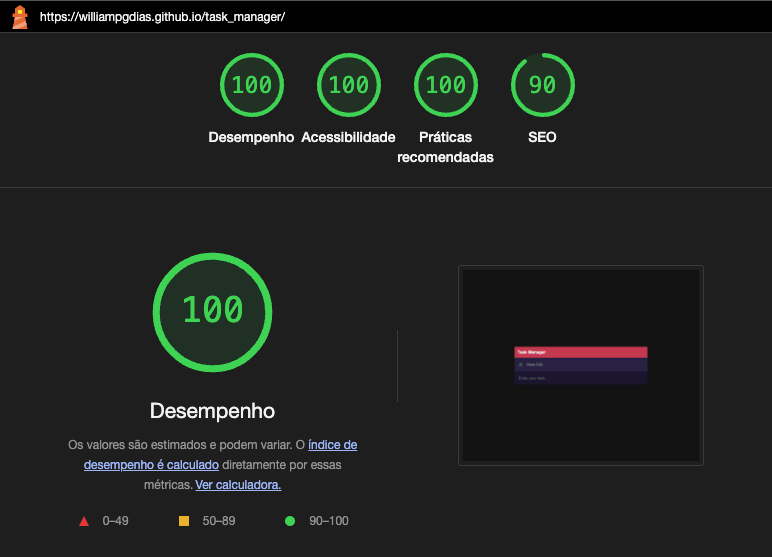

# Gerenciador de Tarefas (Task Manager)

Bem vindo ao Gerenciador de Tarefas, um aplicativo simples e eficiente para organizar e gerencias suas tarefas diárias! Este projeto foi desenvolvido para ajudar os usuários a manterem suas atividades organizadas, proporcionando uma experiência interativa e intuitiva de gerenciamento de tarefas.

Welcome to Task Manager, a simple anda efficient app to organize and manage your daily tasks! This project is designed to help users keep their activities organized, providing an interactive and intuitive task management experience.

# Objetivos dos usuários atuais e novos (Current & New user goals)

O projeto Gerenciador de tarefas foi criado para atender às necessidades de novos visitantes e usuários recorrentes. Cada funcionalidade contribui para a experiência geral de gerenciamento, tornando o projeto atraente e funcional para diferentes objetivos de usuário.

The Task Manager project was designed to meet the needs of both new visitors and returning users. Each feature contributes to the overall management experience, making the project appealing and functional for various user goals.

#Página Inicial (Landing Page)

A página inicial do Gerenciador de Tarefas serve como o primeiro contato visual com o usuário, proporcionando uma visão clara da interface e funcionalidades do aplicativo. É um elemento chave para os usuários se familiarizarem com o ambiente do aplicativo.

The landing page of the Task Manager serves as the first visual interaction with the user, providing a clear view of the interface and features of the app. It is a key element for users to familiarize themselves with the application's environment.

## Controles do Aplicativo (App Controls)

A seção de controles do aplicativo centraliza as informações sobre como utilizar o Gerenciador de Tarefas, oferecendo um caminho claro para que os usuários possam adicionar, editar, ou remover tarefas facilmente.

The app controls section centralizes information on how to use the Task Manager, offering a clear path for users to easily add, edit, or remove tasks.

-   ### Adicionar tarefa (Add Task)

    

-   ### Editar e Remover tarefa (Edit and Remove task)
    

## Visão Geral (Overview)

O Gerenciador de Tarefas traz uma forma simples de organizar suas atividades diárias. Os usuários podem adicionar novas tarefas, marcar como concluídas, editá-las e removê-las, garantindo que suas responsabilidades sejam gerenciadas com eficiência.

The Task Manager brings a simple way to organize your daily activities. Users can add new tasks, mark them as completed, edit, and remove them, ensuring that their responsibilities are managed efficiently.

## Público-Alvo (Target Audience)

O Gerenciador de Tarefas é ideal para qualquer pessoa que deseja organizar melhor sua rotina, desde estudantes até profissionais. Com sua interface simples e intuitiva, o aplicativo pode ser utilizado por pessoas de todas as idades.

The Task Manager is ideal for anyone looking to better organize their routine, from students to professionals. With its simple and intuitive interface, the app can be used by people of all ages.

## Principais Funcionalidades (Key Features)

-   **Interface Amigável**: Design limpo e intuitivo, facilitando o uso para todos os tipos de usuários.
-   **Gerenciamento Interativo**: Adicione, edite e exclua tarefas com facilidade, com atualizações instantâneas na interface.
-   **Persistência de Dados**: As tarefas são salvas no `localStorage`, garantindo que os dados não se percam ao fechar o navegador.
-   **Organização Simples**: Uma maneira rápida e eficaz de acompanhar suas atividades diárias.

-   **User-Friendly Interface**: Clean and intuitive design, making it easy to use for all types of users.

-   **Interactive Management**: Add, edit, and delete tasks easily, with instant updates in the interface.

-   **Data Persistence**: Tasks are saved in localStorage, ensuring data is not lost when the browser is closed.

-   **Simple Organization**: A quick and effective way to track your daily activities.

## Tests (Testing)

Essa seção descreve os testes realizados para garantir a confiabilidade e funcionalidade do Gerenciador de Tarefas.

This section describes the tests performed to ensure the reliability and functionality of the Task Manager.

### Lighthouse

#### Performance

-   Score: 100/100
-   Detalhes: O app tem um bom desempenho em termos de velocidade de carregamento e utilização de recursos.
-   Details: The app performs well in terms of loading speed and resource utilization.

#### Accessibilidade

-   Score: 100/100
-   Detalhes: O app demonstra boas práticas de acessibilidade, garantindo que possa ser usado por uma ampla gama de usuários.
-   Details: The app demonstrates good accessibility practices, ensuring it can be used by a wide range of users.

#### Práticas recomendadas

-   Score: 100/100
-   Detalhes: O app segue muitas boas práticas para desenvolvimento web.
-   Details: The app follows many best practices for web development.

#### SEO

-   Score: 90/100
-   Detalhes: O app segue as melhores práticas SEO, mas ainda falta a metadescrição.
-   Details: The app follows SEO best practices, but we are still missing the meta description

## Testes Funcionais (Functional Testing)

O Gerenciador de Tarefas passou por testes de funcionalidades, incluindo:

-   Teste de criação, edição e exclusão de tarefas.
-   Verificação da persistência dos dados após atualização da página.
-   Verificação da responsividade em diferentes tamanhos de tela.

The Task Manager has undergone functional testing, including:

-   Testing task creation, editing, and deletion.
-   Verifying data persistence after page deletion.
-   Checking responsiveness on differente screen sizes.

## Como usar (How to use)

Para começar a organizar suas tarefas, simplesmente visite o [Gerenciador de Tarefas](https://williampgdias.github.io/task_manager/), digite a tarefa que desejar no "Enter your task" e aperte a tecla Enter para adicionar a tarefa.

To start organizing your tasks, simply visit the [Task Manager](https://williampgdias.github.io/task_manager/), type whatever the task you want on "Enter your task" and press Enter to add the task.

## Créditos (Credits)

Durante o desenvolvimento do Gerenciador de Tarefas, utilizamos referências de diversas fontes para aprimorar o projeto. Agradecemos a todos que contribuíram para tornar este projeto possível.

During the development of Task Manager, we referenced several sources to enhance the project. We are grateful to everyone who contributed to making this project possible.
